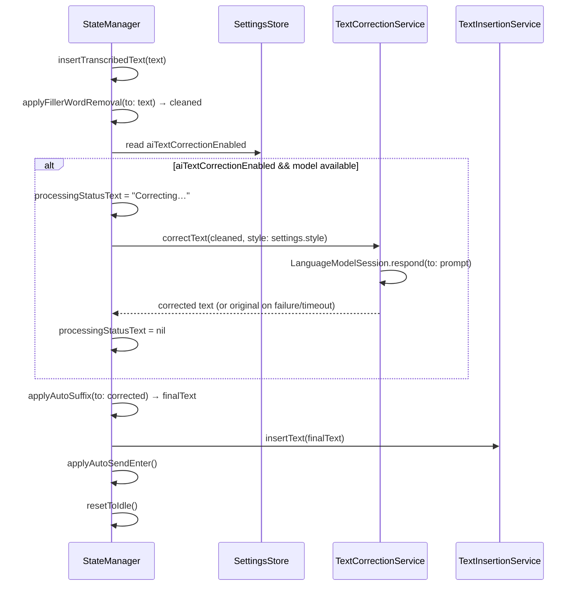

# Design Document: AI Text Correction

## Overview

This design adds on-device AI text correction to Wispr's post-transcription pipeline using Apple's FoundationModels framework. A new `TextCorrectionService` encapsulates all LLM interaction behind a `TextCorrecting` protocol. The correction step sits between filler word removal and auto-suffix in `StateManager.insertTranscribedText()`. The feature is opt-in, gracefully degrades when FoundationModels is unavailable, and shows "Correcting…" in the overlay during LLM inference.

The implementation touches five existing files and introduces three new files:

| File | Change |
|---|---|
| `CorrectionStyle.swift` | **New file** — enum with `.minimal` and `.fullRephrase` cases |
| `TextCorrectionService.swift` | **New file** — `@MainActor @Observable` service wrapping FoundationModels |
| `SettingsStore.swift` | Add 2 new `@Observable` properties + UserDefaults keys |
| `StateManager.swift` | Add `TextCorrectionService` dependency, `applyAITextCorrection()` helper, `processingStatusText` property |
| `SettingsView.swift` | Add toggle, style picker, and availability label in After Transcription section |
| `RecordingOverlayView.swift` | Use `processingStatusText` in processing content |
| `Logger.swift` | Add `textCorrection` logger |
| `SFSymbols.swift` | Add `aiCorrection` symbol |

## Architecture



The correction is applied by `StateManager` using `TextCorrectionService`, keeping `TextInsertionService` unaware of correction logic — it just inserts whatever string it receives.

### Design Rationale

- **Correction after filler removal, before suffix**: Filler removal is a fast regex pass that strips "um", "uh", etc. The LLM operates on already-cleaned text for better results. Suffix is a formatting concern applied last.
- **`@MainActor @Observable`, not actor**: The service needs to expose an `availability` property that the Settings UI observes. Using `@Observable` on `@MainActor` matches the pattern of `SettingsStore` and `HotkeyMonitor`. FoundationModels inference runs on the Neural Engine, not the CPU thread.
- **`TextCorrecting` protocol**: Enables dependency injection of fakes in tests, matching the existing `TextInserting` protocol pattern.
- **Never throws, always returns original text on failure**: The user's dictated text must always be inserted. Correction is best-effort enhancement.

## Components and Interfaces

### CorrectionStyle Enum (New File: `wispr/Models/CorrectionStyle.swift`)

```swift
enum CorrectionStyle: String, Codable, Sendable, CaseIterable {
    case minimal
    case fullRephrase

    var displayName: String {
        switch self {
        case .minimal: "Minimal"
        case .fullRephrase: "Full Rephrase"
        }
    }
}
```

`Codable` for UserDefaults persistence via `JSONEncoder`/`JSONDecoder`, matching the pattern used for `TranscriptionLanguage` in `SettingsStore`. `CaseIterable` for the Settings picker.

### TextCorrecting Protocol and TextCorrectionService (New File: `wispr/Services/TextCorrectionService.swift`)

```swift
import FoundationModels

/// Protocol for text correction, enabling dependency injection in tests.
@MainActor
protocol TextCorrecting: Sendable {
    var availability: TextCorrectionAvailability { get }
    func checkAvailability()
    func correctText(_ text: String, style: CorrectionStyle) async -> String
}

enum TextCorrectionAvailability: Sendable, Equatable {
    case available
    case notAvailable(reason: String)
    case checking
}

@MainActor
@Observable
final class TextCorrectionService: TextCorrecting {
    private(set) var availability: TextCorrectionAvailability = .checking

    func checkAvailability() {
        let model = SystemLanguageModel.default
        switch model.availability {
        case .available:
            availability = .available
        case .notAvailable(.deviceNotEligible):
            availability = .notAvailable(reason: "This Mac does not support Apple Intelligence")
        case .notAvailable(.appleIntelligenceNotEnabled):
            availability = .notAvailable(reason: "Apple Intelligence is not enabled in System Settings")
        case .notAvailable(.modelNotReady):
            availability = .notAvailable(reason: "Apple Intelligence model is not ready yet")
        case .notAvailable(_):
            availability = .notAvailable(reason: "Apple Intelligence is not available")
        @unknown default:
            availability = .notAvailable(reason: "Apple Intelligence is not available")
        }
    }

    func correctText(_ text: String, style: CorrectionStyle) async -> String {
        guard case .available = availability else { return text }
        guard !text.isEmpty else { return text }

        do {
            return try await withThrowingTimeout(seconds: 5) {
                let session = LanguageModelSession(
                    model: .default,
                    instructions: self.systemInstructions(for: style)
                )
                let response = try await session.respond(to: text)
                let corrected = response.content
                return corrected.isEmpty ? text : corrected
            }
        } catch {
            Log.textCorrection.warning("AI text correction failed: \(error.localizedDescription)")
            return text
        }
    }

    private func systemInstructions(for style: CorrectionStyle) -> String {
        switch style {
        case .minimal:
            """
            You are a text correction assistant. Fix grammar errors, typos, and remove speech \
            artifacts (false starts, repetitions, filler words like "um", "uh", "you know"). \
            Keep the original phrasing and tone. Do not add, remove, or change the meaning. \
            Return only the corrected text with no explanation or commentary.
            """
        case .fullRephrase:
            """
            You are a writing assistant. Rewrite the following spoken text as polished written \
            text. Fix grammar, improve sentence structure, and make it read naturally as written \
            prose. Preserve the original meaning and key details. Do not add information that \
            was not in the original. Return only the rewritten text with no explanation or commentary.
            """
        }
    }
}
```

#### Timeout Implementation

The `withThrowingTimeout` helper races the LLM call against a sleep:

```swift
func withThrowingTimeout<T: Sendable>(
    seconds: TimeInterval,
    operation: @Sendable @escaping () async throws -> T
) async throws -> T {
    try await withThrowingTaskGroup(of: T.self) { group in
        group.addTask { try await operation() }
        group.addTask {
            try await Task.sleep(for: .seconds(seconds))
            throw CancellationError()
        }
        let result = try await group.next()!
        group.cancelAll()
        return result
    }
}
```

This is a private utility within `TextCorrectionService`, not a shared helper.

### SettingsStore Changes (`wispr/Services/SettingsStore.swift`)

Two new properties following the existing `didSet` persistence pattern:

```swift
// MARK: - AI Text Correction Settings

var aiTextCorrectionEnabled: Bool {
    didSet {
        guard !isLoading else { return }
        defaults.set(aiTextCorrectionEnabled, forKey: Keys.aiTextCorrectionEnabled)
    }
}

var aiTextCorrectionStyle: CorrectionStyle {
    didSet {
        guard !isLoading else { return }
        if let encoded = try? JSONEncoder().encode(aiTextCorrectionStyle) {
            defaults.set(encoded, forKey: Keys.aiTextCorrectionStyle)
        }
    }
}
```

New keys in `Keys` enum:

```swift
static let aiTextCorrectionEnabled = "aiTextCorrectionEnabled"
static let aiTextCorrectionStyle = "aiTextCorrectionStyle"
```

New defaults in `Defaults` enum:

```swift
static let aiTextCorrectionEnabled: Bool = false
static let aiTextCorrectionStyle: CorrectionStyle = .minimal
```

Update `init`, `load()`, `save()`, and `restoreDefaults()` to include both properties. The `CorrectionStyle` is persisted as JSON `Data`, loaded with `JSONDecoder`, matching the pattern used for `TranscriptionLanguage`.

### StateManager Changes (`wispr/Services/StateManager.swift`)

Add `TextCorrectionService` as a dependency (injected via init, typed as `any TextCorrecting`).

New observable property for overlay status:

```swift
/// Optional custom text shown in the processing overlay.
/// When nil, the overlay shows the default "Processing…" label.
var processingStatusText: String?
```

New helper method:

```swift
/// Applies AI text correction if enabled and available.
/// Returns the corrected text, or the original text if disabled, unavailable, or on failure.
private func applyAITextCorrection(to text: String) async -> String {
    guard settingsStore.aiTextCorrectionEnabled, !text.isEmpty else { return text }
    processingStatusText = "Correcting…"
    let corrected = await textCorrectionService.correctText(
        text,
        style: settingsStore.aiTextCorrectionStyle
    )
    processingStatusText = nil
    return corrected
}
```

Modify `insertTranscribedText(_:)`:

```swift
func insertTranscribedText(_ text: String) async {
    guard !text.isEmpty else { await resetToIdle(); return }
    let cleaned = applyFillerWordRemoval(to: text)
    guard !cleaned.isEmpty else { await resetToIdle(); return }

    // AI text correction step (after filler removal, before suffix)
    let corrected = await applyAITextCorrection(to: cleaned)

    let finalText = applyAutoSuffix(to: corrected)
    // ... rest unchanged (insertText, autoSendEnter, accessibility announce, resetToIdle)
}
```

### SettingsView Changes (`wispr/UI/Settings/SettingsView.swift`)

In `afterTranscriptionSection`, add the AI correction toggle and style picker between "Remove Filler Words" and "Auto-Insert Suffix":

```swift
// After the removeFillerWords toggle:

Toggle("Local AI Text Correction", isOn: $store.aiTextCorrectionEnabled)
    .disabled(textCorrectionService.availability != .available)
    .accessibilityHint("When enabled, uses on-device AI to correct grammar and improve transcription fluency. All processing stays on your Mac.")

if case .notAvailable(let reason) = textCorrectionService.availability {
    Label(reason, systemImage: SFSymbols.info)
        .font(.caption)
        .foregroundStyle(.secondary)
}

if settingsStore.aiTextCorrectionEnabled {
    Picker("Correction Style", selection: $store.aiTextCorrectionStyle) {
        ForEach(CorrectionStyle.allCases, id: \.self) { style in
            Text(style.displayName).tag(style)
        }
    }
}
```

The `textCorrectionService` is accessed via the SwiftUI environment or passed through from the app delegate, matching how other services are referenced in `SettingsView`.

### RecordingOverlayView Changes (`wispr/UI/RecordingOverlayView.swift`)

Update the processing content to use `stateManager.processingStatusText`:

```swift
private var processingContent: some View {
    HStack(spacing: 12) {
        ProgressView()
            .controlSize(.small)
            .accessibilityHidden(true)
        Text(stateManager.processingStatusText ?? "Processing…")
            .font(.callout)
            .foregroundStyle(theme.primaryTextColor)
    }
}
```

### Logger Addition (`wispr/Utilities/Logger.swift`)

```swift
static let textCorrection = Logger(subsystem: subsystem, category: "TextCorrection")
```

### SFSymbols Addition (`wispr/Utilities/SFSymbols.swift`)

```swift
/// Info circle icon for availability status messages.
static let info = "info.circle"
```

## Data Models

| Property | Type | Default | UserDefaults Key |
|---|---|---|---|
| `aiTextCorrectionEnabled` | `Bool` | `false` | `"aiTextCorrectionEnabled"` |
| `aiTextCorrectionStyle` | `CorrectionStyle` | `.minimal` | `"aiTextCorrectionStyle"` |

New types:
- `CorrectionStyle` — enum (`.minimal`, `.fullRephrase`), `Codable`, `Sendable`, `CaseIterable`
- `TextCorrectionAvailability` — enum (`.available`, `.notAvailable(reason:)`, `.checking`) for UI display
- `TextCorrecting` — protocol for dependency injection

## Correctness Properties

### Property 1: Pipeline ordering invariant

*For any* non-empty transcribed text, operations SHALL execute in this order: filler word removal, then AI text correction, then auto-suffix, then text insertion, then auto-send Enter. No step shall execute out of order or be interleaved.

**Validates: Requirements 3.5**

### Property 2: Graceful fallback

*For any* input text and *any* failure mode (model unavailable, LLM error, timeout, empty response), `correctText()` SHALL return the original input text unchanged. The pipeline SHALL never fail, block indefinitely, or discard text due to the correction step.

**Validates: Requirements 4.1, 4.2, 4.4, 5.2**

### Property 3: Settings persistence round-trip

*For any* value of `aiTextCorrectionEnabled` (Bool) and `aiTextCorrectionStyle` (CorrectionStyle), persisting the value to UserDefaults via `SettingsStore` and then creating a new `SettingsStore` instance from the same UserDefaults SHALL yield the original values.

**Validates: Requirements 1.3, 1.4, 1.5**

### Property 4: Feature isolation

*When* `aiTextCorrectionEnabled` is false, THE TextCorrectionService SHALL never be called, and THE pipeline SHALL behave identically to the pre-feature state. No LLM sessions are created, no availability checks gate the pipeline, and no status text changes occur.

**Validates: Requirements 3.2**

### Property 5: Timeout guarantee

THE `correctText()` method SHALL return within 5 seconds regardless of LLM response time. If the model does not respond within the timeout, the original text is returned.

**Validates: Requirements 5.2**

## Error Handling

This feature introduces no new user-visible error states. All failures are handled internally by `TextCorrectionService`:

- **Model not available**: `correctText()` returns original text. No error surfaced. Logged at debug level.
- **LLM inference failure**: Caught, logged as warning via `Log.textCorrection`, original text returned.
- **Timeout (>5s)**: Task group cancellation returns original text. Logged as warning.
- **Empty LLM response**: Treated as failure — original text returned.
- **Settings persistence**: Same `UserDefaults` pattern as all other settings. Cannot fail.

No new `WisprError` cases are needed. The correction step is designed to be invisible on failure — the user simply receives their uncorrected text, which is the same behavior as if the feature were disabled.

## Testing Strategy

### Unit Tests

Unit tests cover specific examples, edge cases, and UI behavior:

- **SettingsStore defaults**: Verify `aiTextCorrectionEnabled` defaults to `false`, `aiTextCorrectionStyle` defaults to `.minimal` (Requirements 1.1, 1.2)
- **SettingsStore persistence**: Verify round-trip for both new properties using in-memory UserDefaults (Requirement 1.3, 1.4, 1.5)
- **Restore defaults**: Verify both properties reset to defaults (Requirements 7.1, 7.2)
- **CorrectionStyle encoding**: Verify `Codable` round-trip for each case
- **Feature disabled**: Verify `applyAITextCorrection` returns text unchanged when disabled (Requirement 3.2)
- **Graceful fallback**: Using a `FakeTextCorrectionService` that simulates failure, verify `correctText` returns original text (Requirements 4.1, 4.2)
- **Pipeline ordering**: Using a `FakeTextCorrectionService`, verify the call order in `insertTranscribedText` (Requirement 3.5)
- **Both modes**: Verify correction applies in both push-to-talk and hands-free modes (Requirement 3.4)
- **SettingsView toggle disabled**: Verify toggle is disabled when availability is `.notAvailable` (Requirement 2.2)
- **Overlay status text**: Verify `processingStatusText` is set to "Correcting…" during correction and nil after (Requirement 5.1)

### Property-Based Tests

Property-based tests verify universal properties across randomly generated inputs. Each property test uses swift-testing's parameterized tests.

Each property test must be tagged with a comment referencing the design property:

```swift
// Feature: ai-text-correction, Property 2: Graceful fallback
// Feature: ai-text-correction, Property 3: Settings persistence round-trip
// Feature: ai-text-correction, Property 4: Feature isolation
```

**Property 2 implementation**: Generate random strings, use a `FakeTextCorrectionService` that throws, verify original text is always returned by the pipeline.

**Property 3 implementation**: Generate random `CorrectionStyle` and Bool values, persist to in-memory UserDefaults, reload via new `SettingsStore`, verify equality.

**Property 4 implementation**: With `aiTextCorrectionEnabled = false`, run the pipeline with a `FakeTextCorrectionService` that records calls. Verify `correctText` was never invoked.

### Testing Approach

- Unit tests and property tests are complementary — unit tests catch concrete bugs and verify specific UI behavior, property tests verify general correctness across all inputs.
- The `TextCorrecting` protocol enables injecting a `FakeTextCorrectionService` in tests, avoiding FoundationModels dependency and Neural Engine requirements in CI.
- The `FakeTextCorrectionService` can simulate: success (returns modified text), failure (returns original), timeout (sleeps then returns), and unavailability.
- Integration testing with the real `SystemLanguageModel` should be done manually on an Apple Intelligence–enabled Mac, not in CI.
