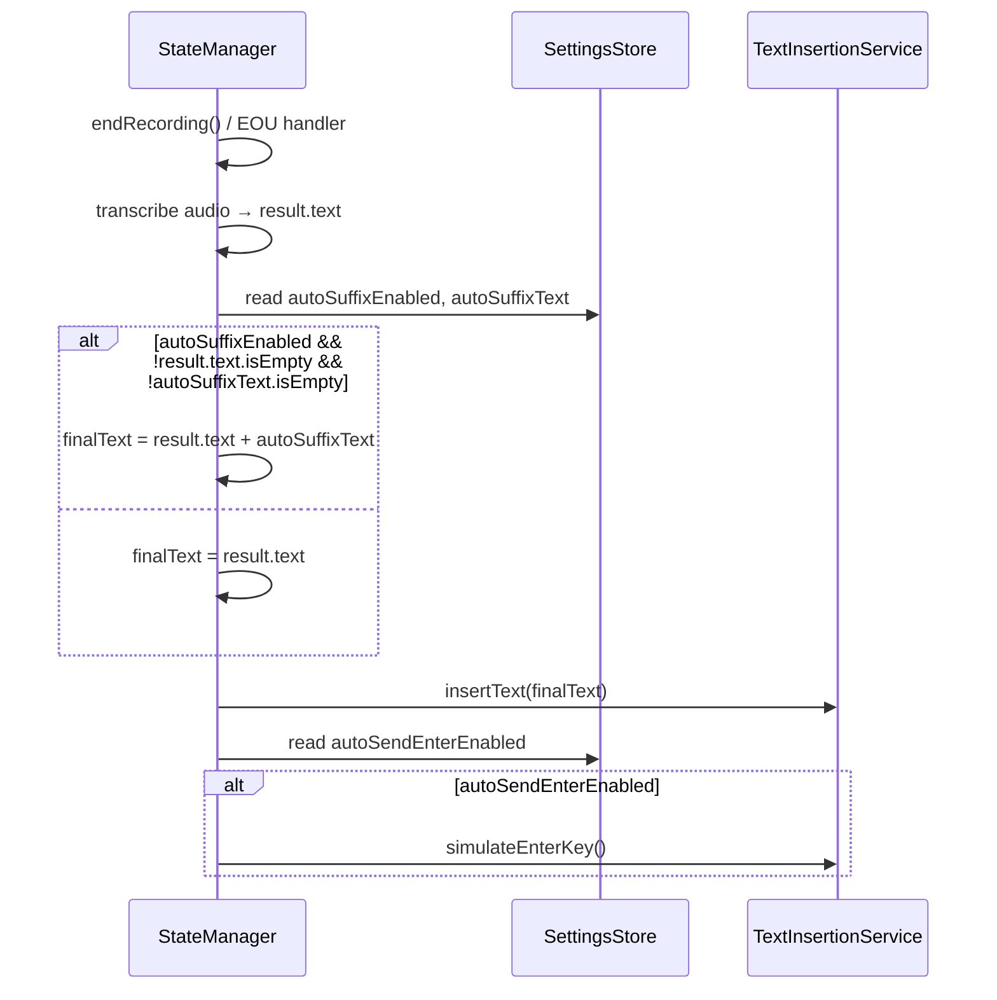

# Design Document: Auto-Suffix Insertion

## Overview

This design adds two independent post-transcription features to Wispr:

1. **Auto-Suffix Insertion** — appends a configurable string (default `" "`) to transcribed text before insertion.
2. **Auto-Send Enter** — simulates an Enter/Return keystroke after text insertion, enabling one-press message sending in chat apps.

Both features are controlled by independent toggles in `SettingsStore`, surfaced in `SettingsView`, and orchestrated by `StateManager`. The order of operations is deterministic: **transcribed text → optional suffix → text insertion → optional Enter keystroke**.

The implementation touches four existing files and introduces one new file:

| File | Change |
|---|---|
| `SettingsStore.swift` | Add 3 new `@Observable` properties + UserDefaults keys |
| `SettingsView.swift` | Add dedicated "After Transcription" section with 2 toggles + `SuffixEditorView` |
| `SuffixEditorView.swift` | **New file** — custom suffix editor with preset picker, custom popover, and whitespace visualization |
| `StateManager.swift` | Modify `endRecording()` and EOU handler to apply suffix and simulate Enter |
| `TextInsertionService.swift` | Add `simulateEnterKey()` method (reuses existing CGEvent pattern) |

## Architecture



The suffix is applied by `StateManager` before calling `TextInsertionService.insertText()`. This keeps `TextInsertionService` unaware of suffix logic — it just inserts whatever string it receives. The Enter keystroke is a separate post-insertion step, also triggered by `StateManager`.

### Design Rationale

- **Suffix applied in StateManager, not TextInsertionService**: The suffix is a user-facing feature tied to transcription flow, not a text insertion concern. Keeping it in `StateManager` means `TextInsertionService` remains a pure text insertion utility, testable in isolation.
- **Enter keystroke in TextInsertionService**: The `simulateEnterKey()` method belongs in `TextInsertionService` because it uses the same CGEvent/accessibility APIs already encapsulated there. `StateManager` calls it but doesn't know the implementation details.
- **Two separate toggles**: Users may want suffix without Enter (e.g., adding punctuation in a document) or Enter without suffix (e.g., sending raw dictation in Slack). Independent toggles give full flexibility.

## Components and Interfaces

### SettingsStore Changes

Three new properties added to `SettingsStore`:

```swift
// MARK: - Auto-Suffix Settings
var autoSuffixEnabled: Bool  // default: false
var autoSuffixText: String   // default: " "

// MARK: - Auto-Send Enter Settings
var autoSendEnterEnabled: Bool  // default: false
```

Each property follows the existing pattern: `didSet` persists to `UserDefaults` (guarded by `isLoading`), and `load()` reads them back on init.

Three new keys in `Keys` enum:
```swift
static let autoSuffixEnabled = "autoSuffixEnabled"
static let autoSuffixText = "autoSuffixText"
static let autoSendEnterEnabled = "autoSendEnterEnabled"
```

### SettingsView Changes

The auto-suffix and auto-send Enter controls live in a dedicated "After Transcription" section (`afterTranscriptionSection`), separate from the Recognition section:

```swift
private var afterTranscriptionSection: some View {
    Section {
        @Bindable var store = settingsStore
        Toggle("Auto-Insert Suffix", isOn: $store.autoSuffixEnabled)
            .accessibilityHint("When enabled, appends a suffix to transcribed text")

        if settingsStore.autoSuffixEnabled {
            LabeledContent("Suffix") {
                SuffixEditorView(suffixText: $store.autoSuffixText)
            }
        }

        Toggle("Auto-Send Enter", isOn: $store.autoSendEnterEnabled)
            .accessibilityHint("When enabled, simulates pressing Enter after text insertion")
    } header: {
        SectionHeader(
            title: "After Transcription",
            systemImage: SFSymbols.textOutput,
            tint: .teal
        )
    }
    .motionRespectingAnimation(value: settingsStore.autoSuffixEnabled)
}
```

Instead of a plain `TextField`, the suffix value is edited via `SuffixEditorView` — a custom component that provides:
- A visual display of the current suffix with whitespace glyphs (␣ for space, ↵ for newline, ⇥ for tab)
- A dropdown menu with common presets: `" "`, `". "`, `"."`, `", "`, `"? "`, `"! "`
- A "Custom…" option that opens a popover with a text field and live preview
- Accessibility labels and hints throughout

The suffix editor is conditionally shown only when `autoSuffixEnabled` is true, matching the existing pattern used for language settings.

### SuffixEditorView (New File)

Located at `wispr/UI/Components/SuffixEditorView.swift`, this view encapsulates all suffix editing UI:

- **Whitespace visualization**: Renders the current suffix using visible glyphs so the user can distinguish spaces, newlines, and tabs at a glance. An empty suffix displays as `∅`.
- **Preset picker**: A `Menu` with a "Common" section listing six frequently used suffixes. The currently active suffix shows a checkmark.
- **Custom editor**: Selecting "Custom…" opens a popover (`SuffixCustomEditor`) with a `TextField`, a live preview of the whitespace-rendered string, and Cancel/Apply buttons.
- **Accessibility**: The visual display has an `accessibilityLabel` that spells out each character (e.g., "space, period, space"). The menu button has a label and hint describing its purpose.

### StateManager Changes

Both `endRecording()` and the EOU monitoring handler need identical suffix/enter logic. Extract a helper:

```swift
/// Applies optional suffix to transcribed text based on settings.
private func applyAutoSuffix(to text: String) -> String {
    guard settingsStore.autoSuffixEnabled,
          !text.isEmpty,
          !settingsStore.autoSuffixText.isEmpty else {
        return text
    }
    return text + settingsStore.autoSuffixText
}

/// Simulates Enter keystroke if auto-send is enabled.
private func applyAutoSendEnter() {
    guard settingsStore.autoSendEnterEnabled else { return }
    textInsertionService.simulateEnterKey()
}
```

In `endRecording()`, after transcription succeeds and before `insertText()`:
```swift
let finalText = applyAutoSuffix(to: result.text)
try await textInsertionService.insertText(finalText)
applyAutoSendEnter()
```

The same pattern applies in the EOU monitoring handler.

### TextInsertionService Changes

Add a public method to simulate Enter/Return:

```swift
/// Simulates an Enter/Return keystroke using CGEvent.
/// Called by StateManager when autoSendEnterEnabled is true.
func simulateEnterKey() {
    // keyCode 0x24 = Return/Enter
    guard let keyDown = CGEvent(keyboardEventSource: nil, virtualKey: 0x24, keyDown: true),
          let keyUp = CGEvent(keyboardEventSource: nil, virtualKey: 0x24, keyDown: false) else {
        return
    }
    keyDown.post(tap: .cghidEventTap)
    keyUp.post(tap: .cghidEventTap)
}
```

This follows the exact same pattern as the existing `simulateCommandV()` method.

### Restore Defaults

Restore Defaults calls `settingsStore.restoreDefaults()`, which resets all properties to their `Defaults` enum values — including `autoSuffixEnabled = false`, `autoSuffixText = " "`, and `autoSendEnterEnabled = false`.

## Data Models

No new data models are introduced. The feature uses three scalar properties on the existing `SettingsStore`:

| Property | Type | Default | UserDefaults Key |
|---|---|---|---|
| `autoSuffixEnabled` | `Bool` | `false` | `"autoSuffixEnabled"` |
| `autoSuffixText` | `String` | `" "` | `"autoSuffixText"` |
| `autoSendEnterEnabled` | `Bool` | `false` | `"autoSendEnterEnabled"` |

These are persisted via `UserDefaults` using the same `didSet`/`load()` pattern as all other `SettingsStore` properties. No database, file, or network storage is involved.


## Correctness Properties

*A property is a characteristic or behavior that should hold true across all valid executions of a system — essentially, a formal statement about what the system should do. Properties serve as the bridge between human-readable specifications and machine-verifiable correctness guarantees.*

### Property 1: Settings persistence round-trip

*For any* value assigned to `autoSuffixEnabled` (Bool), `autoSuffixText` (String), or `autoSendEnterEnabled` (Bool), persisting the value to UserDefaults via `SettingsStore` and then creating a new `SettingsStore` instance from the same UserDefaults should yield the original value.

**Validates: Requirements 1.3, 1.4, 5.2**

### Property 2: Suffix application correctness

*For any* non-empty transcribed text string and any `autoSuffixEnabled`/`autoSuffixText` configuration, the text passed to `TextInsertionService.insertText()` should equal `text + autoSuffixText` when `autoSuffixEnabled` is true and `autoSuffixText` is non-empty, and should equal the original `text` otherwise.

**Validates: Requirements 3.1, 3.2, 3.3**

### Property 3: Enter keystroke conditional execution

*For any* transcription completion, `simulateEnterKey()` should be called if and only if `autoSendEnterEnabled` is true. When `autoSendEnterEnabled` is false, no Enter keystroke simulation should occur.

**Validates: Requirements 5.6, 5.7**

### Property 4: Operation ordering when both features enabled

*For any* non-empty transcribed text, when both `autoSuffixEnabled` and `autoSendEnterEnabled` are true, the system shall first call `insertText()` with the suffix-appended text, and then call `simulateEnterKey()` — never in reverse order and never interleaved.

**Validates: Requirements 5.9**

## Error Handling

This feature introduces minimal new error surface:

- **Suffix application**: Pure string concatenation — cannot fail. No error handling needed.
- **Enter keystroke simulation**: `CGEvent` creation can return `nil` if the system is under extreme resource pressure. The `simulateEnterKey()` method handles this gracefully by returning without action (same pattern as existing `simulateCommandV()`). No error is surfaced to the user because a failed Enter press is non-critical — the text was already inserted successfully.
- **Empty suffix text**: Handled as a no-op (Requirement 3.3). No error state.
- **Settings persistence**: Uses the same `UserDefaults` pattern as all existing settings. `UserDefaults` writes are synchronous and do not throw.

No new `WisprError` cases are needed. The existing error handling in `endRecording()` and the EOU handler covers text insertion failures, which remain unchanged.

## Testing Strategy

### Unit Tests

Unit tests cover specific examples, edge cases, and UI behavior:

- **SettingsStore defaults**: Verify `autoSuffixEnabled` defaults to `false`, `autoSuffixText` defaults to `" "`, `autoSendEnterEnabled` defaults to `false` (Requirements 1.1, 1.2, 5.1)
- **SettingsView toggle visibility**: Verify suffix text field appears when `autoSuffixEnabled` is on and hides when off (Requirements 2.2, 2.3)
- **SettingsView accessibility hints**: Verify both toggles have accessibility hints (Requirements 2.5, 5.5)
- **Restore defaults**: Verify all three new settings reset to defaults (Requirements 4.1, 4.2, 4.3)
- **Both modes**: Verify suffix and Enter apply in both push-to-talk and hands-free modes (Requirements 3.4, 5.8)
- **Edge case — empty suffix text**: Verify no suffix appended when `autoSuffixText` is empty string (Requirement 3.3)

### Property-Based Tests

Property-based tests verify universal properties across randomly generated inputs. Each property test runs a minimum of 100 iterations using the **SwiftCheck** library (or swift-testing's built-in parameterized tests with explicit value ranges for bounded types like Bool).

Each property test must be tagged with a comment referencing the design property:

```swift
// Feature: auto-suffix-insertion, Property 1: Settings persistence round-trip
// Feature: auto-suffix-insertion, Property 2: Suffix application correctness
// Feature: auto-suffix-insertion, Property 3: Enter keystroke conditional execution
// Feature: auto-suffix-insertion, Property 4: Operation ordering when both features enabled
```

**Property 1 implementation**: Generate random strings for `autoSuffixText` and random bools for `autoSuffixEnabled`/`autoSendEnterEnabled`. Write to a `SettingsStore`, create a new instance from the same `UserDefaults`, and assert equality.

**Property 2 implementation**: Generate random non-empty transcription strings and random suffix configurations. Call the `applyAutoSuffix(to:)` helper and verify the output matches the expected concatenation rule.

**Property 3 implementation**: Generate random transcription text and random `autoSendEnterEnabled` values. Use a mock `TextInsertionService` to record whether `simulateEnterKey()` was called, and assert it matches the toggle state.

**Property 4 implementation**: Generate random text and suffix values with both features enabled. Use a mock that records call order to verify `insertText()` is called before `simulateEnterKey()`.

### Testing Approach

- Unit tests and property tests are complementary — unit tests catch concrete bugs and verify specific UI behavior, property tests verify general correctness across all inputs.
- Property tests focus on the core logic (suffix concatenation, conditional execution, ordering) while unit tests cover UI, defaults, and edge cases.
- The `StateManager` suffix/enter logic should be tested via a mock `TextInsertionService` (using the existing `TextInserting` protocol) to avoid CGEvent side effects in tests.
