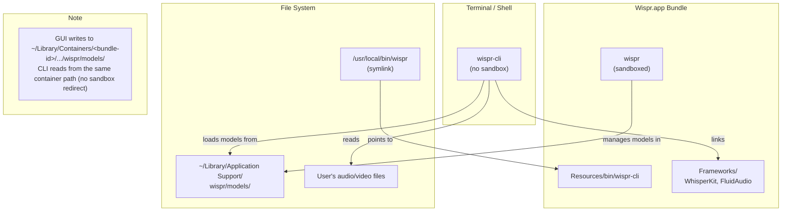
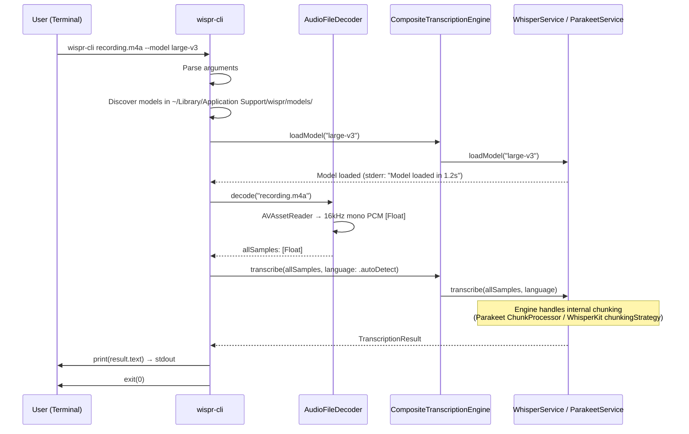

# Design Document: Command-Line Transcription Tool

## Overview

This design adds a standalone command-line tool (`wispr-cli`) embedded in the Wispr application bundle. The CLI decodes audio/video files into PCM samples using AVFoundation, loads transcription models from the shared model directory, and prints transcribed text to stdout. It reuses the same transcription engine code as the GUI app but runs outside the sandbox with Hardened Runtime only.

The implementation adds one new Xcode target, one new source file (`AudioFileDecoder`), one new source file (`CLI/main.swift`), and modifies the GUI app's menu to offer CLI installation. Existing transcription engine code is shared between targets via Xcode target membership.

| File | Change |
|---|---|
| `wispr-cli/main.swift` | **New file** — CLI entry point, argument parsing, orchestration |
| `wispr/Services/AudioFileDecoder.swift` | **New file** — AVAssetReader-based audio decoding to `[Float]` |
| `wispr/Utilities/ModelPaths.swift` | Add sandbox-aware path resolution for non-sandboxed CLI |
| `wispr/UI/MenuBarController.swift` | Add "Install Command Line Tool..." menu item |
| `wispr/UI/CLIInstallDialog.swift` | **New file** — SwiftUI dialog showing the install command |
| Xcode project | New `wispr-cli` command-line tool target with shared source membership |

## Alternatives Considered (Not Selected for Phase A)

### Alternative 1: Client-Server IPC via Unix Domain Socket

**Approach:** The CLI is a thin client that sends file paths to the running GUI app over a Unix domain socket at `~/Library/Application Support/wispr/wispr.sock`. The GUI app performs decoding and transcription, streaming results back.

**Why not selected:**
- Requires the GUI app to be running — a CLI tool that fails when the app isn't open is a poor user experience.
- Adds IPC protocol design complexity (message framing, error propagation, cancellation).
- Sandboxed app creating and listening on a Unix domain socket needs validation — the socket path must be in a sandbox-accessible location, and behavior may vary across macOS versions.
- Doubles the latency for short files (IPC round-trip + processing vs. direct processing).

**When it would be appropriate:** Phase B, as an optimization for users who keep the GUI running. The CLI could try connecting to a socket first (models already loaded = no cold start) and fall back to standalone mode. This hybrid approach is strictly additive and does not affect the Phase A design.

### Alternative 2: XPC Service for Shared Transcription

**Approach:** Extract transcription into an XPC service (`com.stormacq.mac.wispr.transcription`) that both the GUI app and CLI talk to. The XPC service manages model lifecycle and performs transcription.

**Why not selected:**
- XPC services inside sandboxed app bundles inherit the sandbox — the XPC service cannot read arbitrary file paths either, so the CLI would still need to read and pipe audio data.
- Significant architectural refactoring to extract transcription into a separate process.
- `SMAppService` registration and Mach service naming add deployment complexity.
- Overkill for Phase A where the CLI can simply load models directly.

**When it would be appropriate:** If the app grows to support multiple concurrent clients (e.g., Shortcuts integration, Automator actions) that all need shared model lifecycle management.

### Alternative 3: Homebrew Distribution

**Approach:** Distribute the CLI as a separate Homebrew formula or cask post-install stanza, installed to `/usr/local/bin/wispr` automatically.

**Why not selected:**
- Adds an external distribution channel to maintain alongside direct download / App Store.
- CLI binary must still be signed and notarized — distributing outside the app bundle means a separate notarization workflow.
- Versioning must stay in sync between the GUI app and CLI.
- Does not conflict with Phase A — can be added later as an additional installation method.

**When it would be appropriate:** When the app has a Homebrew cask; the cask's `postflight` stanza can create the symlink automatically.

### Alternative 4: Privileged Helper for Symlink Creation

**Approach:** Use `SMAppService.daemon(plistName:)` to install a privileged helper that creates the `/usr/local/bin/wispr` symlink on behalf of the sandboxed app, avoiding the copy-paste command.

**Why not selected:**
- Extremely heavy machinery for creating a single symlink.
- Requires a launchd plist, a separate helper binary, and elevated privilege authorization UI.
- Users installing developer tools from Terminal are comfortable running a single `ln -s` command.
- The copy-to-clipboard UX (VS Code-style) is well understood and sufficient.

## Architecture

### Build Architecture

```
wispr.xcodeproj
├── Target: wispr (Application)
│   ├── Entitlements: App Sandbox + Hardened Runtime
│   ├── Sources: wispr/**/*.swift
│   └── Frameworks: WhisperKit, FluidAudio
│
├── Target: wispr-cli (Command Line Tool)
│   ├── Entitlements: Hardened Runtime only (NO sandbox)
│   ├── Sources: wispr-cli/main.swift
│   ├── Shared Sources (target membership):
│   │   ├── Services/AudioEngine.swift (subset — not needed)
│   │   ├── Services/WhisperService.swift
│   │   ├── Services/ParakeetService.swift
│   │   ├── Services/CompositeTranscriptionEngine.swift
│   │   ├── Services/TranscriptionEngine.swift
│   │   ├── Services/AudioFileDecoder.swift (NEW — both targets)
│   │   ├── Models/ModelInfo.swift
│   │   ├── Models/TranscriptionResult.swift
│   │   ├── Models/TranscriptionLanguage.swift
│   │   ├── Models/ModelStatus.swift
│   │   ├── Models/WisprError.swift
│   │   └── Utilities/ModelPaths.swift
│   ├── Frameworks: WhisperKit, FluidAudio, ArgumentParser
│   └── Embed in: wispr.app/Contents/Resources/bin/
│
├── Target: wisprTests
└── Target: wisprUITests
```

### Runtime Architecture



### Data Flow: CLI File Transcription



## Components and Interfaces

### 1. AudioFileDecoder

A new actor that decodes audio/video files into PCM float samples using AVFoundation. Shared between the CLI and GUI targets.

```swift
/// Decodes audio/video files into 16 kHz mono PCM Float32 samples
/// suitable for transcription engines.
///
/// Uses AVAssetReader for decoding — supports all formats that
/// AVFoundation/CoreAudio can handle (MP3, WAV, M4A, FLAC, AAC,
/// MP4, MOV, etc.) with no additional dependencies.
actor AudioFileDecoder {

    /// Decoded audio metadata returned alongside samples.
    /// Explicitly nonisolated + Sendable so it can cross from this
    /// actor's isolation back to @MainActor callers.
    nonisolated struct AudioMetadata: Sendable {
        let duration: TimeInterval
        let sampleRate: Double
        let channelCount: Int
        let estimatedSampleCount: Int
    }

    /// Returns metadata about the audio track without decoding.
    func metadata(for fileURL: URL) async throws -> AudioMetadata

    /// Decodes the entire audio track into a single [Float] buffer.
    /// Suitable for short files (< 30 seconds).
    func decode(fileURL: URL) async throws -> [Float]

    /// Decodes the audio track in chunks, yielding fixed-size
    /// segments via AsyncStream. Suitable for long files.
    ///
    /// Each chunk contains `chunkDuration` seconds of audio at
    /// 16 kHz mono (default: 30 seconds = 480,000 samples).
    /// Consecutive chunks overlap by `overlapDuration` seconds
    /// (default: 1 second = 16,000 samples) so that words
    /// straddling a boundary are fully captured by at least one chunk.
    /// The last chunk may be shorter.
    func decodeChunked(
        fileURL: URL,
        chunkDuration: TimeInterval = 30.0,
        overlapDuration: TimeInterval = 1.0
    ) -> AsyncThrowingStream<[Float], Error>
}
```

**Implementation notes:**
- Creates `AVAsset` from the file URL, reads the first audio track.
- Configures `AVAssetReaderTrackOutput` with output settings: `kAudioFormatLinearPCM`, 16000 Hz, 1 channel, Float32.
- For `decodeChunked`, reads sample buffers incrementally and yields when the chunk threshold is reached — keeps memory usage bounded regardless of file length. Each chunk overlaps the previous by `overlapDuration` seconds (default 1s / 16,000 samples) so words at boundaries are not split.
- Throws descriptive errors for: file not found, no audio track, unsupported format, read failure.

### 1b. ModelPaths Sandbox-Aware Resolution

The existing `ModelPaths.base` uses `FileManager.urls(for: .applicationSupportDirectory)`, which returns different paths depending on whether the caller is sandboxed. The GUI app (sandboxed) writes models to `~/Library/Containers/com.stormacq.mac.wispr/Data/Library/Application Support/wispr/`, while the CLI (non-sandboxed) would resolve to `~/Library/Application Support/wispr/` — a different, empty directory.

**Fix:** Update `ModelPaths.base` to detect the sandbox container and prefer it when it exists:

```swift
nonisolated static var base: URL {
    // When running outside the sandbox (e.g. wispr-cli), the GUI app's
    // models live in its sandbox container. Prefer that path when it exists
    // so the CLI finds models the GUI downloaded.
    let home = FileManager.default.homeDirectoryForCurrentUser
    let containerPath = home.appendingPathComponent(
        "Library/Containers/com.stormacq.mac.wispr/Data/Library/Application Support/wispr"
    )
    if FileManager.default.fileExists(atPath: containerPath.path) {
        return containerPath
    }

    // Fallback: standard Application Support (works inside the sandbox,
    // or if the container doesn't exist yet).
    guard let appSupport = FileManager.default.urls(
        for: .applicationSupportDirectory,
        in: .userDomainMask
    ).first else {
        fatalError("Application Support directory unavailable — cannot store models")
    }
    return appSupport.appendingPathComponent("wispr", isDirectory: true)
}
```

**Why this works:** macOS allows any process running as the same user to read files inside another app's sandbox container. The GUI app writes models there; the CLI reads them. No App Group provisioning or model migration is needed.

**Trade-off:** Couples the CLI to the GUI's bundle identifier (`com.stormacq.mac.wispr`). If the bundle ID ever changes, this path must be updated. This is acceptable for Phase A — the bundle ID is stable, and a future App Group migration (Phase B) would remove this coupling.

### 2. CLI Entry Point (`wispr-cli/main.swift`)

The CLI is single-threaded and defaults all execution to `@MainActor`. This avoids unnecessary concurrency complexity — the CLI processes one file sequentially and does not benefit from multi-threaded dispatch. Since the project sets `SWIFT_DEFAULT_ACTOR_ISOLATION = MainActor`, the entry point struct and all free functions are implicitly `@MainActor` — no explicit annotation is needed. Only individual actors (`AudioFileDecoder`, the transcription engine actors) run on their own isolation domains.

The CLI entry point uses `swift-argument-parser` for argument parsing, providing built-in `--help` generation, validation, and error messages.

```swift
/// wispr-cli entry point.
///
/// Usage:
///   wispr-cli <file> [--model <name>] [--language <code>] [--output <file>] [--verbose]
///   wispr-cli --list-models
///   wispr-cli --version
/// @MainActor is inherited from SWIFT_DEFAULT_ACTOR_ISOLATION — no
/// explicit annotation needed on the struct or its methods.
@main
struct WisprCLI: AsyncParsableCommand {
    // static let — required by AsyncParsableCommand protocol, cannot be an instance property.
    static let configuration = CommandConfiguration(
        commandName: "wispr-cli",
        abstract: "Transcribe audio and video files using on-device models.",
        version: Bundle.main.object(forInfoDictionaryKey: "CFBundleShortVersionString") as? String ?? "unknown"
    )

    @Argument(help: "Path to the audio or video file to transcribe.")
    var file: String?

    @Option(name: .long, help: "Model name to use for transcription.")
    var model: String?

    @Option(name: .long, help: "Language code for transcription (e.g., en, fr, ja).")
    var language: String?

    @Option(name: .long, help: "Write transcription to a file instead of stdout.")
    var output: String?

    @Flag(name: .long, help: "Print progress and timing information to stderr.")
    var verbose = false

    @Flag(name: .long, help: "List all downloaded models and exit.")
    var listModels = false

    mutating func run() async throws {
        if listModels {
            try await doListModels()
        } else {
            guard let file else {
                throw ValidationError("Missing required argument: <file>")
            }
            try await transcribe(TranscribeConfig(
                filePath: file,
                modelName: model,
                languageCode: language,
                outputPath: output,
                verbose: verbose
            ))
        }
    }

    // All helper methods are instance methods on WisprCLI — see
    // sections 3–5 below for their signatures and implementations.
    // No free functions or static helpers.
}
```

```swift
nonisolated struct TranscribeConfig: Sendable {
    let filePath: String
    let modelName: String?
    let languageCode: String?
    let outputPath: String?
    let verbose: Bool
}
```

**Argument parsing implementation:**
- Uses `swift-argument-parser` (`ArgumentParser` package) for declarative argument definitions, automatic `--help` generation, and input validation.
- The `swift-argument-parser` dependency is added to the Xcode project's Swift Package dependencies and linked only to the `wispr-cli` target (not the GUI app).
- Validates file existence early (before model loading) to fail fast.
- Reads `activeModelName` from `UserDefaults(suiteName: "com.stormacq.mac.wispr")` to access the GUI app's sandboxed defaults domain.

### 3. CLI Transcription Orchestration

```swift
/// Core transcription flow for the CLI.
/// Instance method on WisprCLI — not a free function.
mutating func transcribe(_ config: TranscribeConfig) async throws {
    let fileURL = URL(fileURLWithPath: config.filePath)

    // 1. Resolve model
    let modelName = try resolveModel(config.modelName)
    if config.verbose {
        printStderr("Using model: \(modelName)")
    }

    // 2. Load model
    let engine = CompositeTranscriptionEngine(
        engines: [WhisperService(), ParakeetService()]
    )
    let startLoad = ContinuousClock.now
    try await engine.loadModel(modelName)
    if config.verbose {
        let elapsed = ContinuousClock.now - startLoad
        printStderr("Model loaded in \(elapsed)")
    }

    // 3. Get file metadata
    let decoder = AudioFileDecoder()
    let meta = try await decoder.metadata(for: fileURL)
    if config.verbose {
        printStderr("Audio duration: \(meta.duration)s")
    }

    // 4. Decode and transcribe
    // Decode the full audio and let the transcription engine handle its
    // own chunking strategy. Both WhisperKit and Parakeet have built-in
    // chunk processors with proper overlap, context windows, and token
    // deduplication that produce significantly better results than naive
    // external chunking.
    let language: TranscriptionLanguage = config.languageCode
        .map { .specific(code: $0) } ?? .autoDetect

    let samples = try await decoder.decode(fileURL: fileURL)
    if config.verbose {
        printStderr("Decoded \(samples.count) samples")
    }

    let result = try await engine.transcribe(samples, language: language)
    if let outputPath = config.outputPath {
        try result.text.write(toFile: outputPath, atomically: true, encoding: .utf8)
    } else {
        print(result.text)
    }
}
```

### 4. Model Discovery

```swift
/// Resolves which model to use, in priority order:
/// 1. Explicit --model flag
/// 2. GUI app's active model from UserDefaults
/// 3. Error — no default model
///
/// Instance method on WisprCLI — not a free function.
func resolveModel(_ explicitName: String?) throws -> String {
    let downloadedModels = discoverDownloadedModels()
    guard !downloadedModels.isEmpty else {
        throw CLIError.noActiveModel
    }

    if let name = explicitName {
        guard downloadedModels.contains(where: { $0.name == name }) else {
            throw CLIError.modelNotFound(
                name,
                available: downloadedModels.map(\.name)
            )
        }
        return name
    }

    // Try GUI app's active model from its UserDefaults domain.
    // The GUI app is sandboxed, so its defaults live in a separate domain.
    let guiDefaults = UserDefaults(suiteName: "com.stormacq.mac.wispr")
    if let active = guiDefaults?.string(forKey: "activeModelName"),
       downloadedModels.contains(where: { $0.name == active }) {
        return active
    }

    throw CLIError.noActiveModel
}

/// Scans the shared models directory for downloaded models.
/// Uses ModelPaths.models which resolves to the GUI app's sandbox
/// container when running outside the sandbox (CLI).
///
/// Instance method on WisprCLI — not a free function.
func discoverDownloadedModels() -> [DownloadedModelInfo] {
    // Scans ModelPaths.models (sandbox-aware)
    // Each subdirectory with valid model files is a downloaded model
}
```

### 6. CLI Install Dialog (GUI App)

```swift
/// Dialog shown when user selects "Install Command Line Tool..." from the menu.
struct CLIInstallDialogView: View {
    let appBundlePath: String
    @Environment(\.dismiss) private var dismiss

    private var cliSourcePath: String {
        "\(appBundlePath)/Contents/Resources/bin/wispr-cli"
    }

    private var installCommand: String {
        "sudo ln -sf \"\(cliSourcePath)\" /usr/local/bin/wispr"
    }

    var body: some View {
        VStack(alignment: .leading, spacing: 16) {
            Text("Install Command Line Tool")
                .font(.headline)

            Text("Run this command in Terminal to make `wispr` available from any shell session:")

            GroupBox {
                Text(installCommand)
                    .font(.system(.body, design: .monospaced))
                    .textSelection(.enabled)
            }

            HStack {
                Button("Copy Command") {
                    NSPasteboard.general.clearContents()
                    NSPasteboard.general.setString(installCommand, forType: .string)
                }
                Spacer()
                Button("Done") { dismiss() }
            }
        }
        .padding()
        .frame(width: 500)
    }
}
```

### 7. MenuBarController Changes

Add a single menu item to the existing dropdown, shown only when the CLI is not installed:

```swift
// In MenuBarController, inside menu construction
if !isCLIInstalled() {
    let installCLIItem = NSMenuItem(
        title: "Install Command Line Tool...",
        action: #selector(showCLIInstallDialog),
        keyEquivalent: ""
    )
}
```

```swift
/// Checks whether /usr/local/bin/wispr exists and points to the
/// wispr-cli binary inside the current app bundle.
private func isCLIInstalled() -> Bool {
    let symlinkPath = "/usr/local/bin/wispr"
    let fm = FileManager.default
    guard let dest = try? fm.destinationOfSymbolicLink(atPath: symlinkPath) else {
        return false
    }
    let expectedDest = Bundle.main.bundlePath + "/Contents/Resources/bin/wispr-cli"
    return dest == expectedDest
}
```

The action presents `CLIInstallDialogView` as a sheet or floating panel.

### 8. CLI Error Types

```swift
/// Explicitly nonisolated: with @MainActor as default isolation, this
/// enum would otherwise be @MainActor, preventing it from being
/// constructed or thrown inside custom actors (AudioFileDecoder,
/// transcription engines) without hopping to MainActor.
nonisolated enum CLIError: Error, CustomStringConvertible, Sendable {
    case noModelsDirectory
    case noDownloadedModels
    case noActiveModel
    case modelNotFound(String, available: [String])
    case fileNotFound(String)

    var description: String {
        switch self {
        case .noModelsDirectory:
            "Wispr.app has not been set up yet. Please launch Wispr.app and download at least one model before using the CLI."
        case .noDownloadedModels:
            "No models downloaded. Please open Wispr.app and download at least one model, then try again. Run --list-models to verify."
        case .noActiveModel:
            "No active model set. Use --model <name> or select a model in Wispr.app. Run --list-models to see available models."
        case .modelNotFound(let name, let available):
            "Model '\(name)' not found. Available models: \(available.joined(separator: ", "))"
        case .fileNotFound(let path):
            "File not found: \(path)"
        }
    }
}
```

**Note:** Audio decoding errors (`noAudioTrack`, `unsupportedFormat`, `decodingFailed`) are thrown by `AudioFileDecoder` as `AudioDecoderError`, not `CLIError`. Transcription errors are thrown by the engines as `WisprError`. The CLI catches and displays these at the top level — no wrapping needed.
```

## Xcode Project Configuration

### wispr-cli Target Settings

| Setting | Value |
|---|---|
| Product Type | `com.apple.product-type.tool` (Command Line Tool) |
| Product Name | `wispr-cli` |
| Bundle Identifier | `com.stormacq.mac.wispr-cli` |
| Swift Language Version | 6 |
| Strict Concurrency | `complete` |
| `ENABLE_HARDENED_RUNTIME` | `YES` |
| `ENABLE_APP_SANDBOX` | `NO` |
| `SWIFT_DEFAULT_ACTOR_ISOLATION` | `MainActor` |
| Deployment Target | macOS 26.2 |
| Frameworks | WhisperKit, FluidAudio, ArgumentParser |

### Embedding the CLI in the App Bundle

In the GUI app target's Build Phases:
1. Add a **Copy Files** phase with Destination: "Resources".
2. Set Subpath to `bin`.
3. Add the `wispr-cli` product as the file to copy.
4. Ensure "Code Sign On Copy" is checked.

This places the signed binary at `Wispr.app/Contents/Resources/bin/wispr-cli`.

### Shared Source Files

Source files shared between targets use Xcode's target membership (checked for both `wispr` and `wispr-cli` in the File Inspector). No new framework target or Swift Package is needed for Phase A.

Files with dual target membership:
- `Services/WhisperService.swift`
- `Services/ParakeetService.swift`
- `Services/CompositeTranscriptionEngine.swift`
- `Services/TranscriptionEngine.swift`
- `Services/AudioFileDecoder.swift`
- `Models/ModelInfo.swift`
- `Models/TranscriptionResult.swift`
- `Models/TranscriptionLanguage.swift`
- `Models/ModelStatus.swift`
- `Models/WisprError.swift`
- `Models/DownloadProgress.swift`
- `Utilities/ModelPaths.swift`
- `Utilities/Logger.swift`

Files **not** shared (GUI-only): `AudioEngine.swift`, `TextInsertionService.swift`, `HotkeyMonitor.swift`, `StateManager.swift`, `SettingsStore.swift`, all UI files.

## Data Models

No new data models are introduced for transcription. The CLI reuses all existing model types (`ModelInfo`, `TranscriptionResult`, `TranscriptionLanguage`, `ModelStatus`).

New types specific to the CLI:

```swift
nonisolated struct TranscribeConfig: Sendable {
    let filePath: String
    let modelName: String?
    let languageCode: String?
    let outputPath: String?
    let verbose: Bool
}

/// Metadata about a downloaded model discovered on disk.
nonisolated struct DownloadedModelInfo: Sendable {
    let name: String
    let sizeOnDisk: Int64
    let path: URL
}
```

## Concurrency Design Notes

### Default Actor Isolation

The project sets `SWIFT_DEFAULT_ACTOR_ISOLATION = MainActor` and `SWIFT_STRICT_CONCURRENCY = complete`. The CLI target MUST match these settings so shared source files compile with identical isolation semantics in both targets.

**Consequence:** Every top-level type, function, and property is implicitly `@MainActor` unless explicitly marked `nonisolated` or defined inside a custom actor.

### When to use `nonisolated`

Pure data types that cross isolation boundaries (between `@MainActor` and custom actors like `AudioFileDecoder`, `WhisperService`, `ParakeetService`) MUST be explicitly `nonisolated` and `Sendable`:

- `CLIError` — thrown from custom actors, caught on `@MainActor`
- `TranscribeConfig` — passed from `@MainActor` to helper functions
- `DownloadedModelInfo` — returned from model discovery, used across contexts
- `AudioFileDecoder.AudioMetadata` — returned from actor methods to `@MainActor` callers

Without `nonisolated`, the compiler would require `await` to construct these types from a non-`@MainActor` context (e.g., inside `AudioFileDecoder`), which is incorrect for simple value types.

### `nonisolated(unsafe)` in shared code

The following existing usages in shared source files are justified and require no changes for the CLI:

- `WhisperService.whisperKit` — WhisperKit type is not `Sendable`; actor isolation guarantees serial access.
- `ParakeetService.asrManager` / `eouManager` — FluidAudio types are not `Sendable`; actor isolation guarantees serial access.

The CLI spec introduces **no new** `nonisolated(unsafe)` usage. `AudioFileDecoder` stores AVFoundation types (`AVAssetReader`, etc.) as local variables within actor methods rather than as stored properties, so `nonisolated(unsafe)` is not needed.

### Why `AudioFileDecoder` is an actor (not `@MainActor`)

File I/O and AVAssetReader decoding are blocking operations that should not run on the main actor. Making `AudioFileDecoder` a custom actor gives it its own serial executor, keeping the main actor responsive. The CLI's `@MainActor` orchestration code `await`s into the actor for decoding, then resumes on `@MainActor` to print results.

## Correctness Properties

### Property 1: Output isolation

*For any* invocation of wispr-cli, all diagnostic and progress messages SHALL be written to stderr. Only transcribed text SHALL be written to stdout. This ensures `wispr-cli recording.m4a > transcript.txt` produces a clean text file.

**Validates: Requirements 4.4, 4.5**

### Property 2: Model resolution determinism

*For any* combination of `--model` flag value, UserDefaults `activeModelName`, and set of downloaded models, the `resolveModel()` function SHALL return the same model name given the same inputs, following the priority order: explicit flag > UserDefaults > error.

**Validates: Requirements 3.2, 3.3, 3.4**

### Property 3: Engine-native chunking

*For any* audio file regardless of duration, the CLI SHALL pass the full decoded audio to the transcription engine in a single call. The engine's built-in chunk processor (Parakeet's `ChunkProcessor` with frame-aligned boundaries and mel context, or WhisperKit's `chunkingStrategy`) SHALL handle segmentation, overlap, and token deduplication internally. The CLI SHALL NOT perform its own chunking or overlap deduplication.

**Validates: Requirements 7.1, 7.2**

## Error Handling

| Scenario | Behavior | Exit Code |
|---|---|---|
| File not found | Print error to stderr | 1 |
| No audio track in file | Print error to stderr | 1 |
| Unsupported format | Print error to stderr | 1 |
| No models downloaded | Print error + instructions to stderr | 1 |
| No active model set | Print error + instructions to stderr | 1 |
| Specified model not found | Print error + list available models to stderr | 1 |
| Model loading failure | Print error to stderr | 1 |
| Transcription failure | Print error to stderr | 1 |
| Successful transcription | Print text to stdout | 0 |

All errors are reported as human-readable messages on stderr. No stack traces or internal details are exposed unless `--verbose` is set.

## Testing Strategy

### Unit Tests

- **AudioFileDecoder**: Test decoding of each supported format (MP3, WAV, M4A, MP4, MOV) using short bundled test fixtures. Verify output is 16kHz mono Float32. Verify error cases (missing file, no audio track).
- **Model resolution**: Test all priority paths (explicit, UserDefaults, fallback). Test error when model not found. Test error when no models downloaded.
- **Argument parsing**: Test all flag combinations. Test missing arguments. Test `--help` and `--version` output.
- **Chunked decoding**: Verify chunk boundaries do not skip or duplicate samples. Verify last chunk handles remainder correctly.

### Integration Tests

- End-to-end test: provide a known audio file with known spoken content, run wispr-cli, verify stdout contains expected transcription (fuzzy match).
- Test piping: `wispr-cli test.wav | wc -w` produces non-zero word count.
- Test stderr isolation: redirect stdout to file, verify no diagnostic messages in the file.
